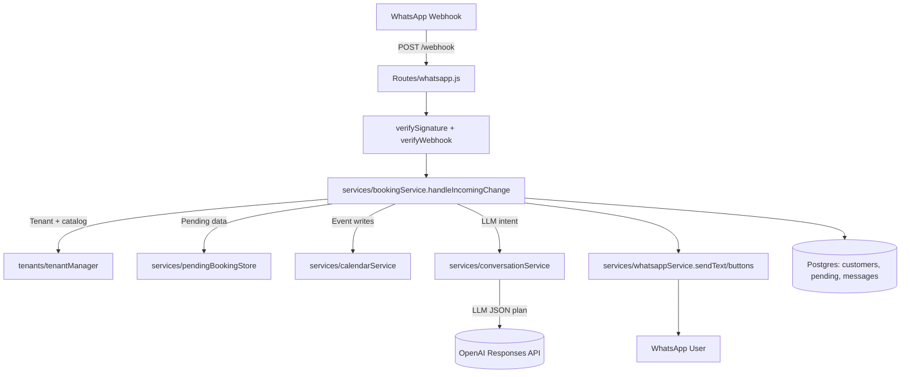
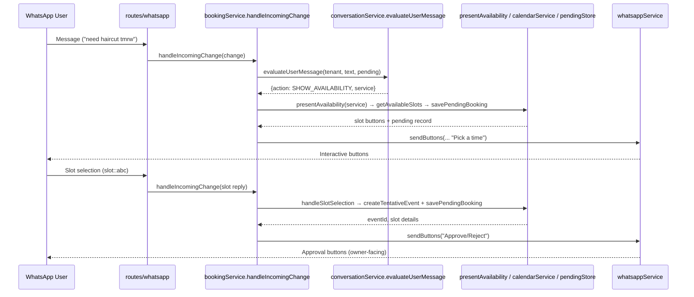

# Chatbot Agent Architecture & Recommendations

## 1. Flow Overview

### Booking Scenario Flow

## 2. Supported Scenarios
1. **Book a service**: customer asks for “haircut tomorrow”. LLM action `SHOW_AVAILABILITY` ⇒ fetch internal calendar slots, return WhatsApp buttons to confirm.
2. **Check pending status**: customer asks “was my booking approved?” while a pending record exists ⇒ reply with the latest status and remind them how approvals work.
3. **Cancel or reschedule**: natural-language cancel intent triggers `CANCEL_BOOKING`, surfaces quick actions (Reject + See other times).
4. **General info**: FAQs, hours, greetings resolved via `ANSWER` action with tenant-specific copy.
5. **Escalate to human**: user explicitly asks; action `ESCALATE` notifies owner.
6. **Fallback / Unknown**: agent cannot parse; replies with localized nudges back to supported tasks.

## 3. Security Considerations
- **Signature verification**: ensure `verifySignature` uses Meta’s `APP_SECRET`; reject mismatches before hitting business logic.
- **Tenant isolation**: all fetches derive from phone-number ID → tenant key; never trust user input for tenant selection.
- **Pending booking abuse**: buttons carry encoded slot IDs; guard `decodeSlotSelection` against tampering and expire pending records.
- **LLM injection**: system prompt enforces business focus but we should sanitize user text when logging and never pipe secrets into prompts.
- **PII storage**: WhatsApp IDs + phone numbers + booking metadata land in Postgres; apply retention pruning (already scheduled) and restrict access.
- **Rate / spam**: implement per-customer throttling to avoid abusive loops.

## 4. Guardrails & Mitigations
- **Schema-enforced LLM output**: `RESPONSE_SCHEMA` demands an action; always validate JSON and default to fallback on parse errors.
- **Language detection**: `detectLanguage` chooses localized fallbacks; add clamps so LLM cannot inject unsupported locales.
- **Command whitelist**: only accept slot IDs that start with the known prefix; reject external commands.
- **Logging / auditing**: `messageStore` stores transcripts. Add alerting when LLM repeatedly returns `ESCALATE` or `UNKNOWN`.
- **Content filtering**: add heuristics (or OpenAI content filter) for harmful text before we mirror back.

## 5. Data Sources Used as Context
- **Tenant configuration**: working hours, timezone, services (min/max minutes, price) from `tenantManager` + DB tables.
- **Service catalog**: `describeServices` summarises ID + name + duration for LLM system prompt.
- **Pending booking state**: `pendingBookingStore` provides slot label/service info for status responses and cancellations.
- **Availability engine**: `availabilityService` queries the internal calendar (Postgres) to compute open slots.
- **Customers & messages**: `customerStore` / `messageStore` keep language and conversation history (used mainly for CRM; not yet in LLM prompt).

## 6. Recommendations & Next Steps
1. **Tool-based architecture**: expose structured “tools” (availability lookup, cancel booking, fetch FAQ) via OpenAI tool-calling or LangChain to reduce orchestration code and let the LLM decide sequencing (“plan-and-execute”).
2. **Memory slices**: feed previous customer turns (recent N logs) into the LLM prompt for better context, while still persisting long-term history in DB for analytics.
3. **Dynamic KB**: index FAQs/policies in a vector store (e.g., PGVector, OpenSearch) and add a retrieval tool for `ANSWER` intents.
4. **Guardrail service**: integrate an allow/deny classifier (OpenAI Moderation or custom) to block sensitive content before hitting conversational logic.
5. **Automatic escalation workflow**: when action `ESCALATE` happens, create an owner notification (email/SMS) instead of only telling the user.
6. **Multi-modal outputs**: support WhatsApp list messages for service selection, not only text/buttons.
7. **Self-service builder**: allow tenants to tweak prompt snippets (tone, languages) safely through a UI; store templates in DB.
8. **Structured tool outputs**: push booking confirmations into analytics pipeline (event bus) to unlock real-time dashboards.

By implementing these enhancements, the chatbot agent can evolve from a single-step intent router into a richer orchestration layer with safer, auditable tooling and better tenant customization.
