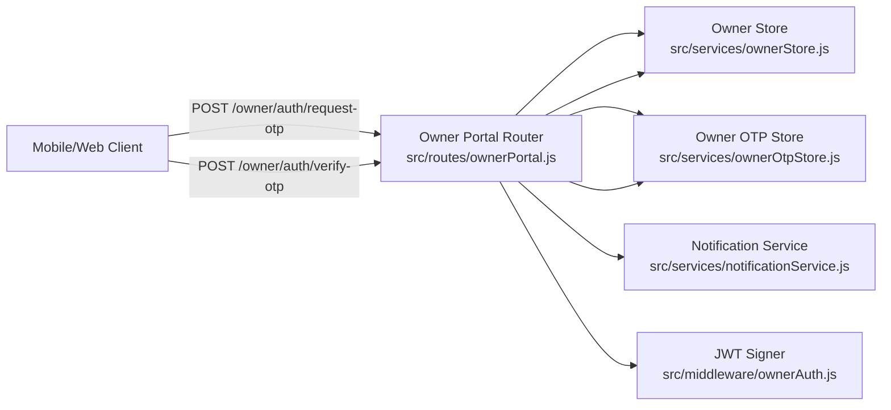
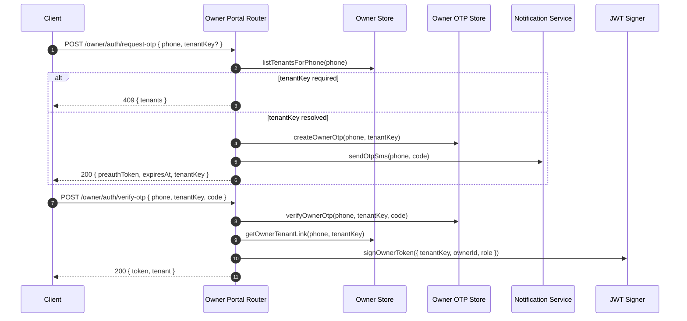

# Owner OTP Auth Design

This document describes the owner OTP authentication feature: design, data flow, and how to debug or extend it.

## Goals
- Replace static owner tokens with phone-based OTP login.
- Support owners linked to multiple tenants with a tenant picker.
- Maintain tenant isolation in JWT claims.

## Data model

Tables (created in `src/db/client.js`):
- `owners`: owner identity by phone/email.
- `owner_tenants`: mapping of owners to tenant keys + role.
- `owner_otps`: OTP challenges for login, with TTL and attempt tracking.

Key fields:
- `owners.phone`: unique identifier for login.
- `owner_tenants.role`: owner vs staff (future role-based permissions).
- `owner_otps`: `code_hash`, `attempts`, `locked_until`, `expires_at`, `preauth_token`.

## API surface

`POST /owner/auth/request-otp`
- Input: `{ phone, tenantKey? }`
- Behavior:
  - Validate phone.
  - Resolve tenant mapping (if multiple, return 409 with tenants).
  - Create OTP challenge and send via SMS.
  - Return `{ status, tenantKey, expiresAt, preauthToken }`.

`POST /owner/auth/verify-otp`
- Input: `{ phone, tenantKey, code }`
- Behavior:
  - Validate OTP (attempts, lock, expiry).
  - Verify owner ↔ tenant link.
  - Return owner JWT + tenant summary.

`GET /owner/tenants`
- Query: `?phone=...&token=...`
- Behavior:
  - Validate preauth token (from request-otp response).
  - Return tenant list for that phone.

Legacy login (kept for backward compatibility):
`POST /owner/login` using tenantKey + owner token.

## Implementation flow

1) Request OTP
   - `src/routes/ownerPortal.js` handles `/owner/auth/request-otp`.
   - `src/services/ownerStore.js` lists tenants for phone.
   - `src/services/ownerOtpStore.js` creates OTP + preauth token.
   - `src/services/notificationService.js` sends SMS (Twilio).

2) Verify OTP
   - `src/routes/ownerPortal.js` handles `/owner/auth/verify-otp`.
   - `src/services/ownerOtpStore.js` checks hash, TTL, attempts, lock.
   - `src/services/ownerStore.js` verifies owner ↔ tenant link.
   - `src/middleware/ownerAuth.js` issues JWT with `tenantKey`, `ownerId`, `role`.

3) Tenant picker (multi-tenant owners)
   - Request OTP without `tenantKey`.
   - If multiple tenants, API returns 409 + tenant list.
   - Client calls `GET /owner/tenants` with preauth token to pick.

## Architecture diagram (Mermaid)

## Flow diagram (Mermaid)

## Failure modes and debug tips

- "Owner not found for phone" (404):
  - No `owners` row or no `owner_tenants` link for that phone.
  - Check `owners.phone` and `owner_tenants` rows.

- "Tenant selection required" (409):
  - Phone is linked to multiple tenants and tenantKey was omitted.
  - Use `/owner/tenants` with the `preauthToken` from request-otp.

- "OTP locked" / "Invalid code" / "OTP expired":
  - Inspect `owner_otps` attempts, locked_until, and expires_at.
  - Make sure `OWNER_OTP_SECRET` is set (hashing must be consistent).

- SMS not sent:
  - Twilio credentials missing in env (`TWILIO_*`).
  - Check logs for "Twilio not configured".

## Security notes

- OTP codes are stored hashed using `OWNER_OTP_SECRET`.
- Attempts are tracked in `owner_otps`; lockout uses `locked_until`.
- JWT contains tenantKey and role to preserve tenant isolation.

## Future extensions

- Add refresh tokens (`/owner/auth/refresh`).
- Add email OTP fallback.
- Add rate limiting and IP throttling around OTP endpoints.
