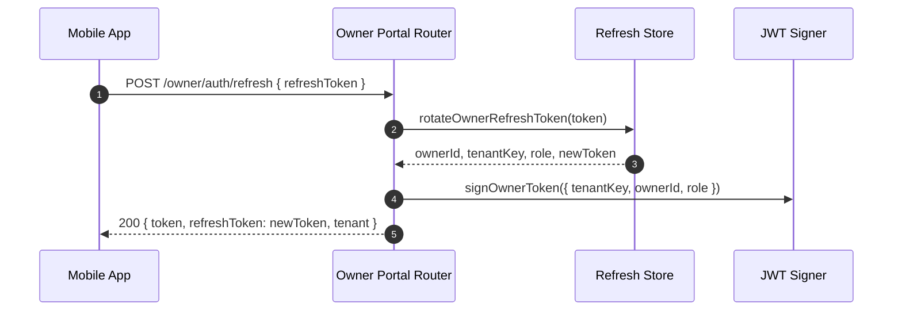

# Owner Refresh Token Flow

This document explains the refresh-token design, API flow, and how to debug or extend it.

## Goals
- Keep owners logged in without manual re-auth.
- Rotate refresh tokens on every use to reduce replay risk.
- Preserve tenant isolation (tenantKey + role in JWT).

## Data model

Table: `owner_refresh_tokens` (created in `src/db/client.js`)
- `owner_id` → `owners.id`
- `tenant_key` → `tenants.key`
- `role`
- `token_hash` (SHA-256 of token + secret)
- `expires_at`, `revoked_at`

Tokens are stored as hashes; raw tokens are only returned to the client once.

## API contract

`POST /owner/auth/refresh`
- Input: `{ refreshToken }`
- Output (success):
  - `token` (JWT)
  - `refreshToken` (new rotated token)
  - `tenant` (key, name, calendarLink)
- Output (failure): `401 { error }`

## Backend flow

1) Client sends `refreshToken` to `/owner/auth/refresh`.
2) `rotateOwnerRefreshToken`:
   - Look up token hash in `owner_refresh_tokens`.
   - Reject if missing, revoked, or expired.
   - Revoke the old token.
   - Create a new token row (rotation).
3) Issue a new JWT with `tenantKey`, `ownerId`, `role`.
4) Return the new JWT + refresh token.

## Mobile flow

1) On successful OTP verification, app stores `refreshToken` in SecureStore.
2) When an API call returns 401:
   - App calls `/owner/auth/refresh` and retries the request once.
3) On logout, app clears the refresh token from SecureStore.

## Architecture diagram (Mermaid)

## Failure modes and debug tips

- `Refresh token not found`:
  - Token was revoked or never issued.
  - Check `owner_refresh_tokens` rows and hash generation.

- `Refresh token expired`:
  - Check `expires_at` and configured TTL via `OWNER_REFRESH_TTL_DAYS`.

- Client stuck in 401 loop:
  - Ensure the app only retries once.
  - Confirm `refreshToken` is saved after OTP verify and after refresh.

## Related files
- `src/services/ownerSessionStore.js`
- `src/routes/ownerPortal.js`
- `src/middleware/ownerAuth.js`
- `apps/owner-mobile/App.tsx`
