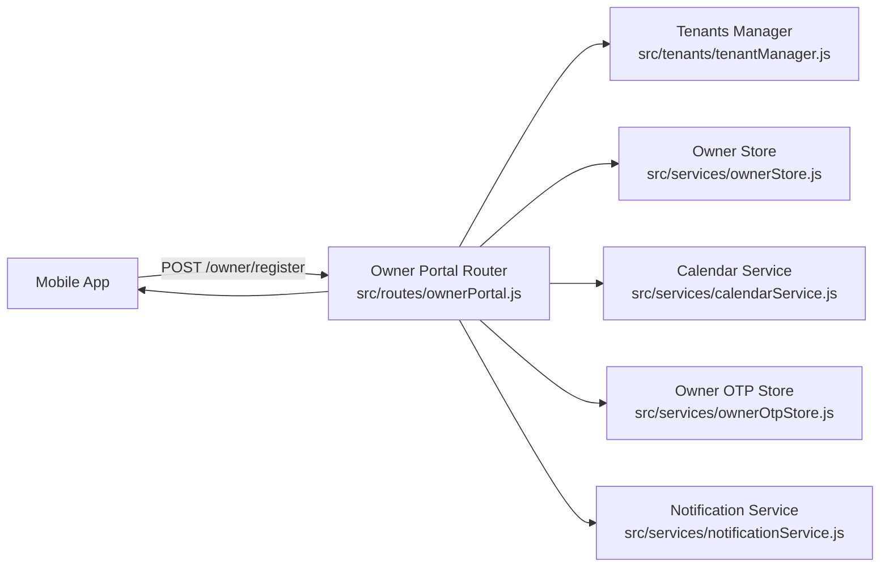

# Owner Registration Flow

This document explains the owner registration flow for the mobile app and backend, including the API contract and data model impact.

## Goals
- Allow a new owner to create a tenant from the app.
- Seed core tenant metadata (business name, timezone, optional services).
- Kick off OTP verification and complete login without admin involvement.

## User experience (mobile)

1) Owner selects "Create account" on the login screen.
2) Owner fills:
   - Business name
   - Owner name
   - Phone (E.164)
   - Email (optional)
   - Timezone
   - Optional services (name, duration, price, currency)
3) App sends registration request to backend.
4) Backend returns an OTP challenge.
5) App sends the user to OTP verification.
6) Owner verifies OTP and becomes authenticated.

## API contract

`POST /owner/register`
- Input:
  - `displayName` (string, required)
  - `ownerName` (string, required)
  - `phone` (string, required, E.164 format)
  - `email` (string, optional)
  - `timezone` (string, optional, default "UTC")
  - `services` (array, optional)
    - `name` (string)
    - `minMinutes` (number)
    - `maxMinutes` (number)
    - `price` (number)
    - `currency` (string)
- Output:
  - `status: "sent"`
  - `tenantKey`
  - `expiresAt`
  - `preauthToken`

## Backend flow

1) Validate input in `src/routes/ownerPortal.js`.
2) Ensure phone is not already registered (via `listTenantsForPhone`).
3) Create tenant with `registerOwnerTenant`:
   - `tenants` row with minimal fields.
   - `calendar` default seeded using timezone.
   - optional `services` seeded.
4) Create/update owner identity:
   - `owners` row via `upsertOwner`.
   - `owner_tenants` link via `linkOwnerToTenant`.
5) Seed calendar data in `calendars`, `calendar_rules`, `calendar_blocks`.
6) Create OTP challenge and send SMS.
7) Return OTP response for the client to verify.

## Architecture diagram (Mermaid)

## Failure cases and debug tips

- `409 Phone already registered`:
  - Phone already linked to at least one tenant in `owner_tenants`.
  - Use OTP login instead.

- `400 displayName, ownerName, and phone are required`:
  - Missing required fields in request.

- SMS not sent:
  - Check Twilio configuration in env.
  - Logs should show "Twilio not configured" if missing.

## Related files
- `apps/owner-mobile/App.tsx`
- `src/routes/ownerPortal.js`
- `src/tenants/tenantManager.js`
- `src/services/ownerStore.js`
- `src/services/ownerOtpStore.js`
- `src/services/notificationService.js`
